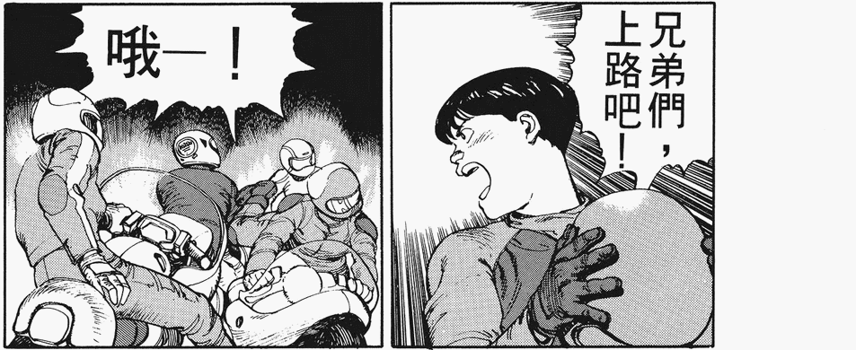
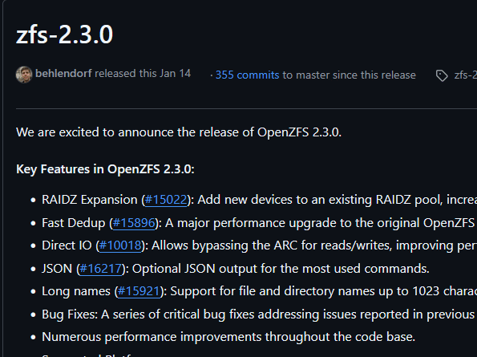

<h1 align="center">Tangoji</h1>

<p align="center">
 🌐 <em>Your AI Language Learning Companion for the Web</em> 📘
</p>

<p align="center">
  
</p>

<p align="center">
  
  &nbsp;
  <a href="https://addons.mozilla.org/en-US/firefox/addon/tangoji/">
    
  </a>
</p>

<p align="center">
  
  
  
</p>

---

## ✨ Overview: Welcome to Smarter Language Learning!

Tangoji isn't just another language tool; it's your intelligent, privacy-first companion that transforms your daily web Browse into an immersive and effective language learning adventure. By harnessing the power of **your local AI through Ollama**, Tangoji offers seamless translation, intelligent OCR, and dynamic flashcard creation—all without your data ever leaving your machine. Say goodbye to context switching and hello to learning in the flow! 🌊

<p align="center">
  
</p>

## 🌟 Key Features

* 🧠 **AI-Powered Translations:** Instantly translate selected text on any webpage. Understand foreign content with rich context, powered by sophisticated AI models running on your personal Ollama setup.
* 👁️ **Intelligent OCR (Text from Images):** Encounter text embedded in an image? Tangoji's AI can extract it for you! Perfect for learning from memes, infographics, social media posts, or scanned documents online.
* 🃏 **Dynamic Flashcards:** Effortlessly create interactive flashcards from words or phrases you discover. Reinforce your learning with AI-generated example sentences and helpful grammar notes.
* ✂️ **Area Capture & OCR ("BOOM 💥 Capture!"):** Select any part of your screen with a simple drag-and-select. Tangoji captures it, performs OCR, and lets you instantly translate or create flashcards from the extracted text.
* 🚀 **Local AI with Ollama:** All AI processing happens locally via your Ollama instance. This means your data remains private, and you have full control over the AI models you use. Ultimate power, ultimate privacy.
* 🌐 **Learn As You Browse - Seamlessly:**
    * 🖱️ **Floating Icon:** Appears on text selection for quick translation and actions.
    * 🟢 **Floating Action Button (FAB):** A discreet, always-accessible button in the bottom-right corner (10% opacity, 100% on hover) for instant area capture.
* 🎨 **Customizable Themes:** Switch between sleek Light ☀️ and cool Dark 🌙 modes to suit your visual preference and reduce eye strain during late-night study sessions.
* ⚙️ **Flexible Settings:** Tailor Tangoji to your needs! Configure your Ollama server URL, preferred native and learning languages, specific AI models for text and multimodal tasks, and more.
* 🔄 **Data Management:** Your learning journey, your data. Easily export all your flashcards, learning progress, and settings for backup. Just as easily, import data to get started or switch devices.

## 🛠️ Getting Started in Minutes

1.  **Install Ollama:**
    Make sure you have [Ollama](https://ollama.com/) installed and running.
   ```bash
   # Pull the multimodal model
   ollama pull qwen2.5vl
   # Pull the language model
   ollama pull  gemma3
   ```

   > 💡 Tip: To check if Ollama is running, just run `ollama` or try `http://localhost:11434`.
   
2.  **Install Tangoji:**
    * [Get Tangoji on Chrome (Coming Soon)](https://chromewebstore.google.com/) 
    * [Get Tangoji on Firefox](https://addons.mozilla.org/en-US/firefox/addon/tangoji/)
3.  **Configure Tangoji:**
    * Open Tangoji's settings (usually by clicking the extension icon and finding the "Settings" or "Options" page).
    * Verify or set your Ollama server URL (defaults to `http://localhost:11434`).
    * Select your native and target learning languages.
    * Choose your preferred AI models from those available in your Ollama instance.
4.  **Start Your Enhanced Learning!** Select text on a webpage or click the FAB.

## 📖 How to Use Tangoji - Your Workflow

* **Translate Text:** Simply select any text on a webpage. A discreet floating icon will appear; click it to open the translation and actions popup. You can also use the right-click context menu.
* **Capture Area (OCR & Translate):**
    * Click the Floating Action Button (FAB) 🟢 in the bottom-right corner.
    * Alternatively, use the "Capture with Tangoji" option from the right-click context menu.
    * Draw a rectangle over the area you wish to capture. Tangoji performs OCR and presents the extracted text in a handy popup for translation or flashcard creation.
* **Create Flashcards:**
    * After translating selected text or capturing an image/area, you'll find options to save the content as a flashcard.
    * Import words in bulk via the "Import" section of the Tangoji Dashboard.
    * Use the "Generate" section to process your collected temporary words into rich flashcards, with AI assistance for example sentences and grammar insights.
* **Study Flashcards:** Head to the "Study" section in the Tangoji Dashboard for an interactive, spaced-repetition based learning session.
* **Manage Your Data:** The "Settings" page allows you to export all your data (cards, temporary words, study history, and app settings) for backup or import previously exported Tangoji data.

<p align="center">
  <em>Fluid Text Selection & Instant Translation</em><br>
  <br>
  <em>Effortless Area Capture & OCR in Action</em><br>
  <br>
  <em>Dynamic Flashcard Creation and Study Interface</em><br>
  
</p>

## ⚙️ Deep Customization

Tangoji is built to adapt to *your* unique learning style and technical setup:

* **Ollama Server Configuration:** Easily point Tangoji to your local Ollama instance or a remote server if you prefer.
* **Language Preferences:** A wide array of supported languages for both your native tongue and the languages you're mastering.
* **AI Model Selection:** Choose specific Ollama models for text generation and multimodal (image-to-text) capabilities from those you have installed and available in Ollama.
* **Visual Theme:** Enjoy Tangoji in a bright Light Mode ☀️ or a focused Dark Mode 🌙. Your choice, your comfort.

## 💬 Feedback, Support & Community

If you encounter an issue, have a feature request, or want to contribute to improving Tangoji, we welcome your input.

- **Bug Reports:** Help us maintain stability by reporting any unexpected behavior.  
- **Feature Requests:** Suggest improvements or new functionality.  
- **General Feedback:** Share your experience to help us enhance the project.

➡️ Please [open an issue on our GitHub repository](https://github.com/zkrvf/Tangoji/issues).

## 📜 License

Tangoji is licensed under the [Creative Commons Attribution-NonCommercial-ShareAlike 4.0 International License](https://creativecommons.org/licenses/by-nc-sa/4.0/).

---

<p align="center">
  <strong>Happy Language Learning with Tangoji! 🌐📚💡</strong>
</p>
<p align="center">
  <em>Stay curious. Stay learning.</em>
</p>